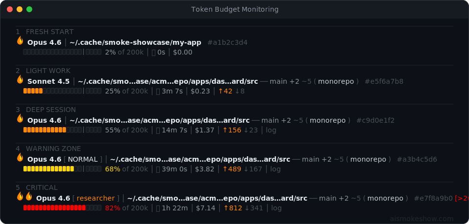
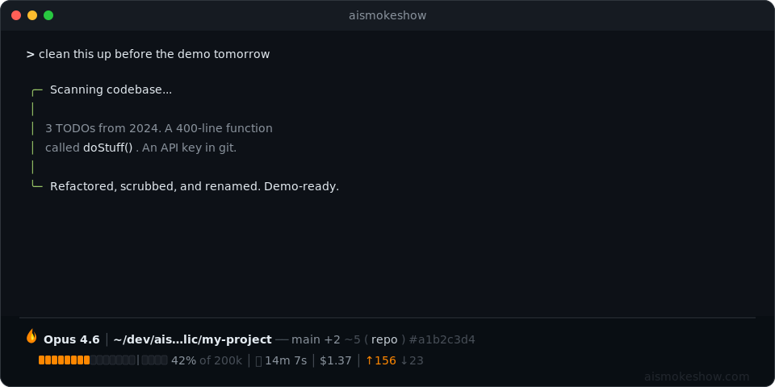

<div align="center">

# AISMOKESHOW Claude Code Status Line

**An opinionated statusline for Claude Code.**

Dark. Minimal. Ember-accented. Always know where you are.

<p>
  
  &nbsp;
  
  &nbsp;
  
</p>

</div>

<p align="center"><em>Python 3.9+ · No dependencies · macOS &amp; Linux</em></p>

<p align="center">
  <picture>
    <source media="(prefers-color-scheme: dark)" srcset="images/statusline-ais-hero-dark.jpg">
    <source media="(prefers-color-scheme: light)" srcset="images/statusline-ais-hero-light.jpg">
    
  </picture>
</p>

---

<p align="center">
  
</p>

<p align="center">
  <br>
  <em>"Finally a statusline that tells me what actually matters. Context window, cost, git state — all at a glance."</em>
  <br><br>
</p>

<p align="center">
  <a href="#install">Install</a> ·
  <a href="#why-this-exists">Why This Exists</a> ·
  <a href="#what-you-get">What You Get</a> ·
  <a href="#design-smoke-palette">Palette</a> ·
  <a href="#customization">Customize</a> ·
  <a href="#faq--troubleshooting">FAQ</a>
</p>

## Install

Open [Claude Code](https://github.com/anthropics/claude-code) and paste:

```
Install this on my Mac → https://github.com/aismokeshow/statusline-starter
```

That's it. Claude copies the script, updates your settings, and verifies it works. No pip install, no config wrangling.

> [!TIP]
> **Already cloned the repo?** Open Claude Code in the repo folder and type `/install`.

<details>
<summary><strong>Manual install</strong></summary>

```bash
cp statusline-smoke.py ~/.claude/statusline-smoke.py
chmod +x ~/.claude/statusline-smoke.py
```

Add to `~/.claude/settings.json`:

```json
{
  "statusLine": {
    "type": "command",
    "command": "python3 ~/.claude/statusline-smoke.py",
    "padding": 1
  }
}
```

</details>

Preview the statusline before installing — no config changes needed:
```bash
python3 statusline-smoke.py --preview
```

**Three slash commands** — everything you need after install:

| Command | What it does |
|---|---|
| `/install` | Copy the script, configure settings, verify it works |
| `/customize` | Change colors, bar width, thresholds, hidden elements |
| `/uninstall` | Remove the script and statusLine config cleanly |

> [!WARNING]
> This project tells Claude Code to run shell commands. Only clone from the [official repo](https://github.com/aismokeshow/statusline-starter) — forks can modify the instructions Claude follows. The script itself is stdlib-only Python with zero network calls — [read the source](statusline-smoke.py) to verify.

## Why This Exists

Every other statusline shows wrong context percentages. They read the raw `used_percentage` from Claude Code's JSON and display it as-is — but that number doesn't account for the internal safety buffer or output reservation that Claude Code subtracts before firing auto-compact. So you think you have 20% context left, and then the session compacts. Now you're scrambling to re-establish context, losing momentum on whatever you were building.

This statusline solves that. The [compact threshold formula](statusline-smoke.py#L381-L392) is reverse-engineered from Claude Code's source — it subtracts the output reservation (default 32K tokens) and the internal 13K safety buffer to show you the *real* percentage where auto-compact fires. The progress bar has a literal threshold marker so you can see pressure building before the reset hits.

The other problems I kept hitting:

**Paths that disappear.** I run 5+ [Claude Code](https://github.com/anthropics/claude-code) instances in my terminal at once. Every statusline I tried would truncate the directory path to some useless fragment that looked like every other session. This one fish-abbreviates long names (`aismokeshow_build_in_public` becomes `ais...lic`) but always shows the full path in the clickable link.

**Terminal breakage.** I use [Ghostty](https://ghostty.org), and every other statusline would choke on terminal resizing or vanish entirely. I'd have to restart Claude Code and start over. This one works in every terminal that runs Claude Code — [Ghostty](https://ghostty.org), [iTerm2](https://iterm2.com), [Kitty](https://github.com/kovidgoyal/kitty), [WezTerm](https://wezfurlong.org/wezterm/), [Alacritty](https://alacritty.org), Terminal.app, all of them.

## What You Get

Other statuslines show a model name and a percentage. Here's what this one does differently.

<p align="center">
  
</p>

**The compact threshold is on the bar.**
That `│` marker in the progress bar shows exactly where Claude Code fires auto-compact. It's calculated from the [reverse-engineered formula](statusline-smoke.py#L381-L392) — context size, minus output reservation, minus the internal 13K safety buffer. The bar color shifts ember → yellow → red as you approach it. You see context pressure building before the reset hits.

**Paths that actually fit.**
Long directories get fish-abbreviated — `aismokeshow_build_in_public` becomes `ais…lic` — but the full path stays in the clickable link. The display adapts to your terminal width. You always see where you are without horizontal scroll.

**Built for multiple instances.**
Every session gets a visible `#session_id`. Git info is cached per-directory with separate temp files — three Claude Code instances on three projects never step on each other's data.

**Clickable everything.**
Cmd+click the directory to open it in Finder. Click the repo name for GitHub. Click `log` for the full transcript. All via [OSC 8](https://gist.github.com/egmontkob/eb114294efbcd5adb1944c9f3cb5feda) hyperlinks — works in [Ghostty](https://ghostty.org), [iTerm2](https://iterm2.com), [Kitty](https://github.com/kovidgoyal/kitty), [WezTerm](https://wezfurlong.org/wezterm/). In Ghostty, hold Cmd while hovering to make links clickable.

**Drift detection.**
If Claude's working directory wanders laterally from your project root (not just into a subdirectory), you'll see `(from project_name)` — so you know before something breaks.

**Two lines. Everything that matters.**

| | |
|---|---|
| **Line 1** | 🔥 model · clickable directory · git branch +staged ~modified · (repo link) · #session_id |
| **Line 2** | progress bar with compact marker · context % · duration · cost · ↑added ↓removed · transcript link |

Fire doubles up (🔥🔥) at the compact threshold. Also shows agent name, vim mode, and `[>200k]` warnings when relevant — hidden when not.

## Design: SMOKE palette

Grayscale backbone. Ember accents. No visual noise.

| Color | ANSI | Role |
|---|---|---|
| Bright white | `97m` | Primary text, directory path |
| Light gray | `37m` | Secondary text, percentages |
| Dark gray | `90m` | Separators, muted labels |
| Bright orange | `38;5;208m` | Ember accent, progress bar |
| Warm yellow | `38;5;220m` | Warning zone (approaching compact threshold) |
| Red | `38;5;196m` | Critical zone (at/past compact threshold) |

No extra colors for git or diffs — everything maps to the grayscale + ember palette above.

## Customization

Everything is editable. The full guide is in [`docs/CUSTOMIZATION.md`](docs/CUSTOMIZATION.md) — here are the quick hits:

**Swap the accent color** — change `EMBER` to any ANSI 256 color:
```python
EMBER = "\033[38;5;75m"   # steel blue instead of orange
```

**Hide an element** — set its segment variable to `""`:
```python
session_seg = ""   # hide the #session ID
cost_seg = ""      # hide cost
```

**Change bar width** — adjust `BAR_W`:
```python
BAR_W = 30   # wider bar (default: 20)
```

Full theme presets (Nord, Catppuccin, etc.), threshold tuning, and element-by-element reference: [CUSTOMIZATION.md](docs/CUSTOMIZATION.md)

## Works With Other Starters

| Starter | What it adds | Interaction |
|---|---|---|
| [dotfiles-starter](https://github.com/aismokeshow/dotfiles-starter) | Modern shell config — [Zerobrew](https://github.com/lucasgelfond/zerobrew), [Starship](https://starship.rs), [Sheldon](https://sheldon.cli.rs), 12 CLI tools | Zero interaction — statusline runs independently |
| [aerospace-starter](https://github.com/aismokeshow/aerospace-starter) | Tiling window manager — F1 toggles workspaces | Zero interaction — statusline runs independently |

All three work together seamlessly. Install order doesn't matter.

## Requirements

- Python 3.9+ (stdlib only, no pip install needed)
- Git (optional — for branch/repo features)

> [!NOTE]
> Clickable links require a terminal with OSC 8 support:
> **[Ghostty](https://ghostty.org)**, **[iTerm2](https://iterm2.com)**, **[Kitty](https://github.com/kovidgoyal/kitty)**, **[WezTerm](https://wezfurlong.org/wezterm/)** — full support.
> **macOS Terminal.app** — no link support (everything else still works).
> **[tmux](https://github.com/tmux/tmux)** — may strip OSC sequences.

## Performance

- Pure Python, no external dependencies
- Git operations cached for 5 seconds per directory
- Per-directory cache files prevent collision across multiple instances
- No API tokens consumed (runs locally)

## FAQ / Troubleshooting

**Nothing changed after install.**
Restart Claude Code or start a new session. The statusline loads on session start.

**Links aren't clickable.**
Your terminal needs [OSC 8](https://gist.github.com/egmontkob/eb114294efbcd5adb1944c9f3cb5feda) support. [Ghostty](https://ghostty.org), [iTerm2](https://iterm2.com), [Kitty](https://github.com/kovidgoyal/kitty), and [WezTerm](https://wezfurlong.org/wezterm/) work. macOS Terminal.app does not support clickable links (everything else still renders fine). [tmux](https://github.com/tmux/tmux) may strip OSC sequences.

**The bar colors don't match my theme.**
The SMOKE palette is baked into the script. Swap the 6 color variables to match your terminal theme — see [CUSTOMIZATION.md](docs/CUSTOMIZATION.md#change-the-color-palette).

**I see garbled characters (boxes, question marks).**
Your terminal font needs Unicode block character support (▰▱). Most modern monospace fonts include them. Try a Nerd Font or [JetBrains Mono](https://www.jetbrains.com/lp/mono/).

**How does this work with multiple Claude Code instances?**
It already handles it. Git info is cached per-directory (no collisions), and the `#session_id` suffix lets you tell instances apart at a glance.

## License

[MIT](LICENSE)

---

<p align="center"><sub>built by <a href="https://www.aismokeshow.com/">aismokeshow</a> · where there's smoke, there's code</sub></p>
